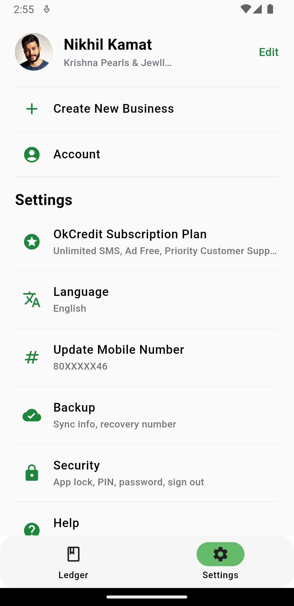

# Pasella Ledger

### Project Structure

#### The project structure is organized in the following way:

- constants: contains the constants (mainly for themeing)
- lib: contains the main Dart code for the application
- pages: contains the different screens for the application
- widgets: contains the various common widgets used throughout the application
- assets: contains any necessary assets used in the application

### Installation

#### Clone the repository using the following command:

#### Rename the project directory before running flutter commands

```bash
mv pasella-app pasella
```

#### Navigate to the project directory:

```bash
cd pasella
```

#### Install the dependencies:

```bash
flutter pub get
```

#### Run the application:

```bash
flutter run
```

### Screenshots

&nbsp;&nbsp;&nbsp;
&nbsp;&nbsp;&nbsp;
<br><br>

&nbsp;&nbsp;&nbsp;
&nbsp;&nbsp;&nbsp;
<br><br>
